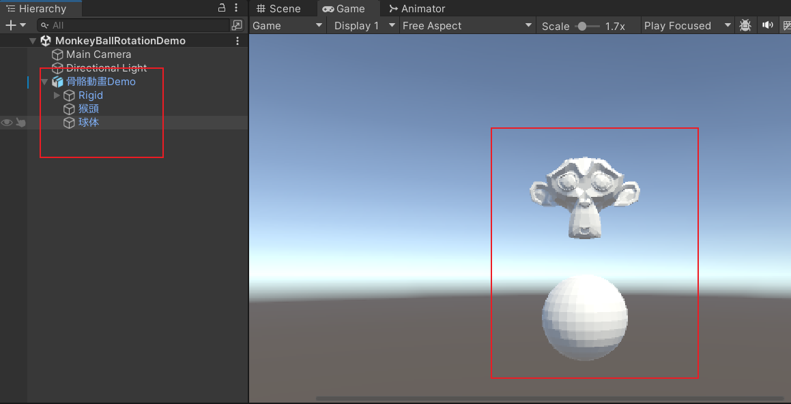
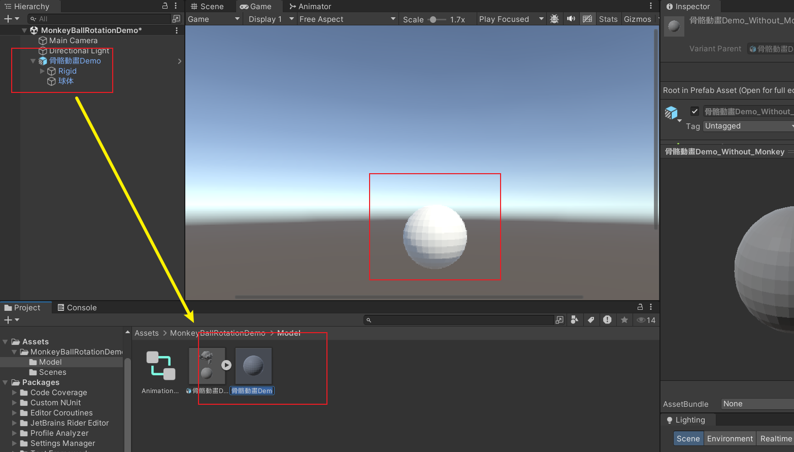
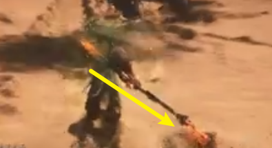
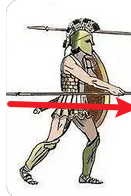

# 掛載點

  遊戲中，有時候我們需要動態地向場景中已有的對象添加額外得模型。例如，武器，服裝，以及一些特效。**放置這些額外模型的地方就是掛載點**。 遊戲中的人物(掛載對象中，人物最爲典型，後面我們都以人物爲例子)是在不斷移動的，但是，在模型座標系下，我們所關注的，相對於人物的坐標大致上是不變的。所以，**我們在模型座標系下來描述掛載點。** 

但是，在模型坐標系下還是有些物體是會發生移動的。比如說，當人物揮動武器時，武器相對於模型坐標原點就是移動的。那我們怎麼確定模型坐標呢?**這時候，就得依靠骨骼了。** 現在的模型動畫基本上都使用骨骼動畫，**將武器模型掛載在骨骼上，當骨骼進行動畫時，武器也會隨之移動。** 所以，**我們會使用骨骼來確定掛載點。**

## 模型掛載點

這裏的模型是指那些具有固定形態的，一般情況下長期存在的模型，比方說武器，服裝之類的現實物體。和特效掛載點做區分只是因爲用途不太一樣，因此用途是我們主要討論的地方。但在這之前，我們先體驗一下模型的動態掛載。

## 模型的動態掛載

我们使用一個簡單的**具有父子關係的模型**來展示這個概念。

 

這是一個簡單的骨骼動畫（光照忘了加，將就着看），Blender Monkey繞着Sphere旋轉。他們的層級關係如下：





我們將模型和骨骼導入Unity（FBX格式）。



模型地動畫是如同Blender所渲染出來的顯示。在Unity中層級顯示如下

Blender 中，模型顯示爲骨骼的子物體，Unity中則顯示爲同級物體。這隱含了一個Unity的知識點，即：**Unity動畫移動骨骼，骨骼坐標會改變。同時模型顯示會改變，但實際上坐標值是不變的。**

掛載點的意義在於，如果這個Blender猴頭不是一開始就在模型中的，而是遊戲中動態添加的， 我們將使用掛載點來確定這個位置。

下面，我們將猴頭從模型中刪除。

然後使用腳本動態裝配，腳本可以在文檔的Git倉庫中找到。



將猴頭切換成服裝或者是武器，就可以直接在項目中使用了。詳細的知識點，在腳本的註釋中都有寫，請程序多多關注。

## 模型掛載點的用途以及處理技巧

## 物品掛載

武器掛載是最常見的使用場景，取決於遊戲設計，多種多樣。

### 簡單的物品掛載

**最簡單的武器掛載不會影響動畫和動作**，比方說移動，不會因爲角色舉了一把大劍就變得緩慢，甚至是動作變爲拖動大劍前進。這種情況下，動畫文件和骨骼是沿用原本的。基本上，**這種情況只用與飾品等輕小物體**。

## 影響骨骼動畫的物品掛載

大部分情況下物品掛載都會影響動畫。正常跑步我們雙手位於軀幹兩側，但是當持有長武器時，一般就是持於背後：

或者Low一點，橫舉在身側：

**這類影響動畫的物品掛載，只會影響當前動畫，並不會改變人物的動畫狀態機。**

如果遊戲設定說，一個角色只能持有一種類型的武器，那麼裝配新的武器並不會增加新的動作模式，只會修改原本模型動畫。更甚，
不需要修改原本動畫，只是簡單改變武器模型。

這種情況有兩種處理方式：

- 在原本的狀態機中，添加子狀態機，把持有物體作爲條件
- 在裝配物體的同時，賦予人物新的狀態機

顯然，第二種方式最佳。

## 掛載後的骨骼和動畫要怎麼處理

爲什麼會有這個問題，首先考慮如下場景：

我要向人物掛載一把武器，比方說錘子，但是原本角色的骨骼和動畫只考慮了空手的情況。因此，
如果我直接將這把錘子掛載到角色上的話，**骨骼上沒有錘子的動畫信息，錘子是沒辦法移動的**。我們得使用新的，
考慮了錘子的骨骼和動畫才可以正確顯示動畫。

相反地，**如果裝配的武器原本在模型中**，只是被移除，然後再動態添加，這種情況下，只需要把武器簡單裝配到人物上就好了。
原本的骨骼和動畫信息考慮了這把武器，武器可以正確地進行動畫。

## 場景掛載

**最常見的武器掛載其實就是NPC了**。NPC需要動態的放到指定位置，供劇情使用。這點和物品掛載差別很大，掛載在場景上，是相對於地圖而言的，**我們可以使用場景的模型坐標來描述這個掛載點。如果地圖是不動地(一般是不動地)。那麼使用世界座標系來描述也是可以接受了。**  

## 特效掛載點

# 相關閱讀

- [骨骼動畫以及Unity中得骨骼動畫](./骨骼動畫以及Unity中的骨骼動畫.md) , 講述了骨骼動畫的一些原理我們主要關注**父子關係**，以及**動畫文件是如何影響骨骼的** 這兩部分內容
- [人形骨骼結構層次與命名](../項目約定/人形骨骼結構層次與命名.md) ， QS項目中關於人形骨骼的要求，裏面有對項目是如何設計掛載點作出闡述

